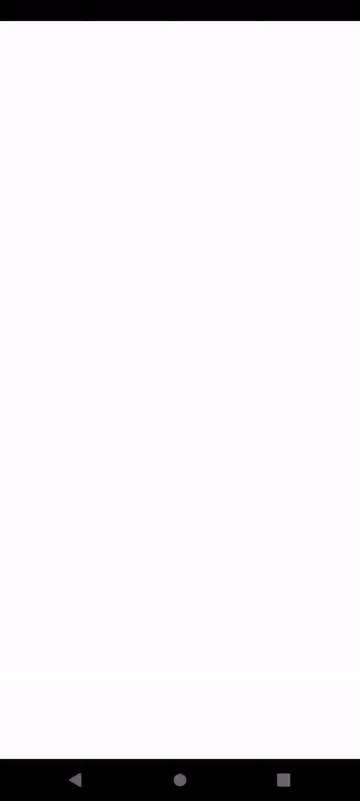

### Project Overview

# Crypto Watchlist and Chart Mobile Application

This Flutter-based mobile application is designed to display real-time cryptocurrency data, allowing users to track the prices and market trends of various cryptocurrencies. The app features a clean, modern design that is user-friendly and intuitive. It leverages WebSockets for live data updates and offers interactive charts for price movement visualization.

## Key Features

- **Watchlist**: Displays a list of selected cryptocurrencies with real-time updates of their prices and percentage changes. Users can easily monitor their favorite coins such as Bitcoin, Ethereum, and others.
- **Detailed Crypto Data**: Each cryptocurrency displays:
    - **Current Price** in USD.
    - **Daily Price Change** showing the difference in price since the start of the day.
    - **Percentage Change** indicating the percentage increase or decrease.
- **Interactive Price Chart**: When a cryptocurrency is selected from the watchlist, the user is presented with an interactive price chart showing real-time price movement. Users can zoom and pan to focus on specific time intervals.
- **Real-Time Updates**: The app uses WebSocket technology to ensure that all cryptocurrency data is updated in real time without needing to refresh.
- **Elegant UI**: The app design includes smooth animations, modern fonts, and clean card-based layouts, making the interface visually appealing and intuitive to navigate.

## Demo

| Android Demo | iOS Demo |
|--------------|----------|
|  |  |

## Technical Overview

- **Real-Time Data via WebSockets**: The app connects to a WebSocket server that streams cryptocurrency data, allowing for instant price updates.
- **Interactive Watchlist and Line Charts**: Detailed Watchlist and Charts provide users can monitor their selected cryptocurrencies with a list and a graphical representation of price movement over time. The X-axis represents time in intervals, and the Y-axis shows the price in USD.

## Architecture Overview

The project is structured into several layers, adhering to the Clean Architecture design:

### 1. Core Layer
- **Purpose**: Contains essential utilities shared across the app, such as environment configuration, dependency injection, and constants.
### 2. Data Layer
- **Datasources**: Responsible for interacting with external data sources, like WebSockets or REST APIs.
   - `socket_datasource.dart`: Manages WebSocket communication for real-time data streaming.
- **Models**: Defines data structures used throughout the app.
   - `crypto_model.dart`: Represents the cryptocurrency data structure.
- **Repositories (Implementation)**: Implements the logic for data management and communicates with the domain layer.
   - `crypto_repository_impl.dart`: Concrete implementation of repository patterns for fetching data.
### 3. Domain Layer
- **Repositories (Interface)**: Defines repository contracts, which ensure the domain layer is abstracted from specific data sources.
   - `crypto_repository.dart`: Abstract repository that the data layer implements.
- **Use Cases**: Encapsulates the business logic.
   - `get_crypto_usecase.dart`: Handles retrieving cryptocurrency data as a business operation.
### 4. Presentation Layer
- **Blocs**: Manages application state using the BLoC (Business Logic Component) pattern.
   - `crypto_bloc.dart`: Handles the state management for real-time cryptocurrency updates.
   - `crypto_state.dart`: Defines different states for the app (e.g., loading, data received, error).
- **UI Pages**: Components responsible for rendering the user interface.
   - `dashboard_page.dart`: Displays the dashboard containing the cryptocurrency watchlist and charts.
   - `stock_card.dart`: A widget displaying individual cryptocurrency details in the watchlist.
   - `crypto_chart.dart`: Displays price movement charts for selected cryptocurrencies.
### 5. Utilities
- Contains helper functions and utilities for enhancing app functionality.

---

## Sample Data Structure

The application interacts with WebSocket APIs for real-time data and also includes support for fetching historical data when needed (to be integrated in future updates). Below is an example of the data structure used in the app:

```json
{
  "tickerCode": "BTC-USD",
  "lastPrice": 60272.20,
  "quantityOfTrade": 0.5,
  "dailyChangePercentage": -0.89,
  "dailyDifferencePrice": -536.27,
  "time": 1633024800
}
```

### How to Run the Project

Follow these steps to set up and run the project on your local machine:

1. **Clone the Repository**:
    - First, clone the repository to your local machine using the following command:
      ```sh
      git clone https://github.com/yourusername/yourproject.git
      ```
    - Navigate to the project directory:
      ```sh
      cd yourproject
      ```

2. **Install Dependencies**:
    - Ensure that you have Flutter installed on your machine. If not, follow the official [Flutter installation guide](https://flutter.dev/docs/get-started/install).
    - Install the necessary dependencies by running:
      ```sh
      flutter pub get
      ```

3. **Create the `.env` File**:
    - Create a `.env` file in the root directory of your project. This file is used to store environment variables like API URLs.
    - Example content for the `.env` file:
      ```sh
      BASE_URL=wss://ws.eodhistoricaldata.com/ws/crypto?api_token=demo
      SYMBOLS=BTC-USD, ETH-USD
      ```
    - Ensure that the `.env` file is included in your `.gitignore` to avoid committing sensitive information.

4. **Run the Application**:
    - To run the application on an emulator or a physical device, execute the following command:
      ```sh
      flutter run
      ```
    - Ensure that you have an emulator running or a physical device connected. You can check connected devices by running:
      ```sh
      flutter devices
      ```
